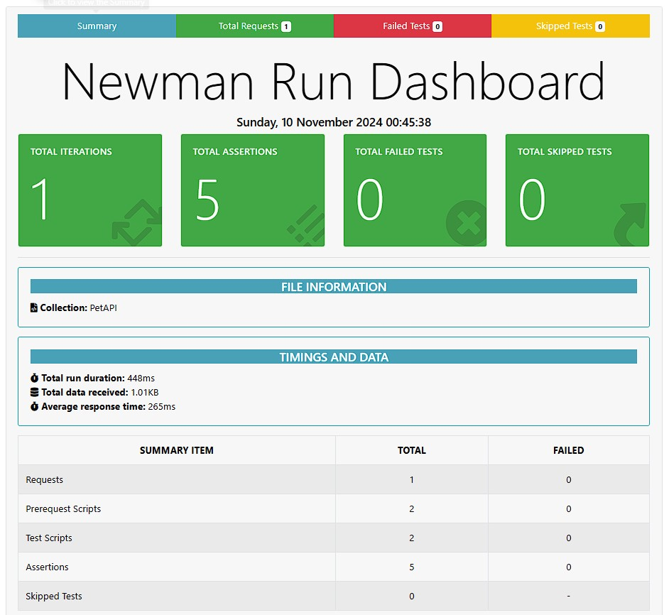

## Pet API Test

**Objective:**  

The objective of the Pet API Testing Project is to automate the testing of API services for pet-related data, ensuring they function correctly and reliably. The project leverages Postman collections run by Newman and integrates with GitHub Actions for continuous integration and deployment (CI/CD).

**Tools:**  
- Newman
- Postman
- GitHub Action
- Node.js

**Project Structure:**

```sql
dogapipostmannewmanghactions/
├── .github
│   └── workflows
│       └── ci.yml                     # GitHub Actions workflow configuration
├── newman
│   └── newman-run-report.html         # HTML test reports generated by Newman
├── package.json                       # npm scripts and dependencies configuration
├── PetAPI.postman_collection.json     # Postman collection for API testing
└── README.md                          # Project description and details
```

**Scripts:** 

`npm run`

- `test`: Runs tests using Newman and generates an HTML report.

- `test:report`: Runs tests and generates an HTML report with detailed results.

**Reporting:**

Newman is used for generating detailed test reports, providing insights into test results, and making it easier to understand the test execution and outcomes.

